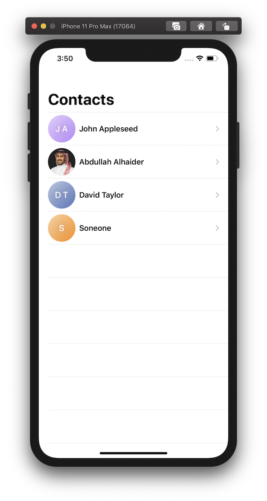
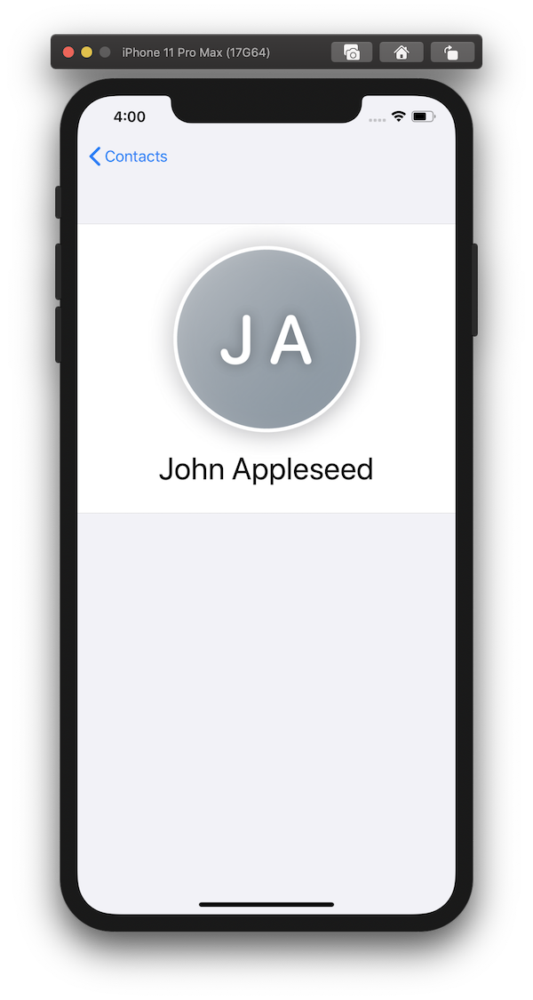
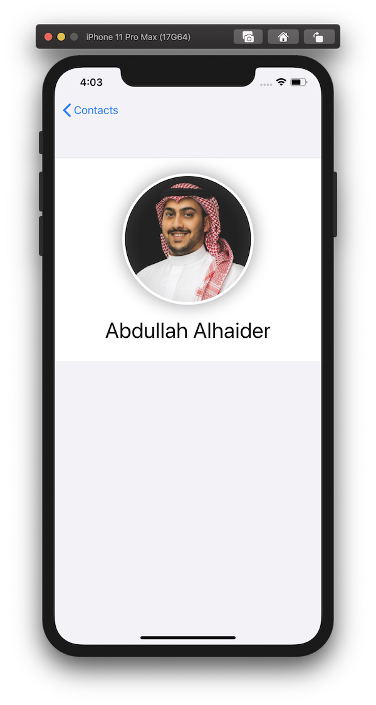
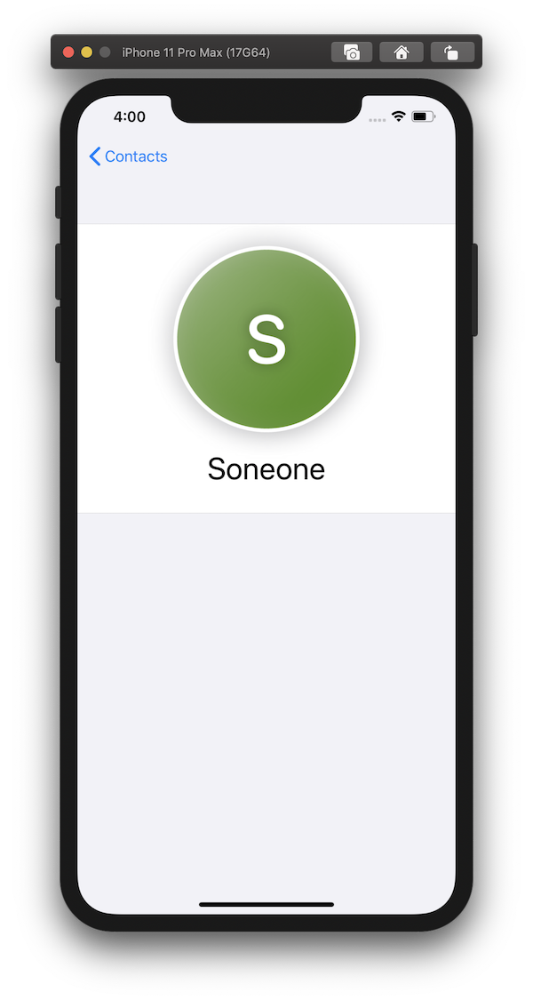

# ProfilePlaceholderView

Add profile placeholder when there is no image 😎

## Example Contacts app

| List of contacts | #1. | #2. | #3. |
| --- | --- | --- | --- |
|  |  |  |  |


---

- [Installation](#installation)
- [Usage](#usage)
- [Author](#author)
- [License](#license)


## Installation

> It requires iOS 13 and Xcode 11!

In Xcode go to `File -> Swift Packages -> Add Package Dependency` and paste in the repo's url: `https://github.com/cs4alhaider/ProfilePlaceholderView`


## Usage

```swift
import ProfilePlaceholderView
```

Then add `.withProfilePlaceholderView( ... )` under `Image` like:
```swift
struct ContactRow: View {
    let contact: Contact
    
    var body: some View {
        HStack {
            Image(contact.imageString ?? "")
                .resizable()
                .withProfilePlaceholderView(name: contact.name) // HERE YOU CAN PASS MANY THINGS ALSO
                .clipShape(Circle())
                .frame(width: 60, height: 60)
            
            Text(contact.name)
                .font(.headline)
        }
    }
}

```

or, if you don't want to use any image and you just need a placeholder, then do this:
```swift
struct ContactRow: View {
    let contact: Contact
    
    var body: some View {
        HStack {
            ProfilePlaceholderView(name: contact.name)
                .clipShape(Circle())
                .frame(width: 60, height: 60)
            
            Text(contact.name)
                .font(.headline)
        }
    }
}
```

Check the **Example** project for more details 


## Author
[Abdullah Alhaider](https://twitter.com/cs4alhaider), cs.alhaider@gmail.com

## License

This project is under the MIT license. See the LICENSE file for more info.
